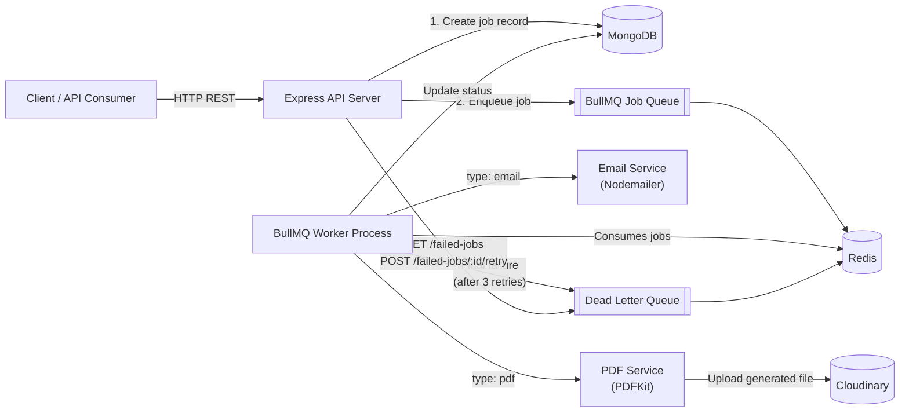

# TaskFlow

**A distributed, fault-tolerant job processing platform built with Node.js, BullMQ, and Redis.**

TaskFlow lets clients submit background jobs (emails, PDF report generation, and more) over a REST API. Jobs are queued in Redis via BullMQ, picked up by independent worker processes, retried automatically with exponential backoff on failure, and routed to a dead-letter queue when retries are exhausted — with a dedicated endpoint to inspect and replay failed jobs.


---

## 📖 Project Overview

Most backend projects stop at "submit a request, get a response." TaskFlow goes a step further by decoupling job *submission* from job *execution*, a pattern used in real production systems for tasks too slow or unreliable to run inline (sending emails, generating documents, processing media).

When a job is created, TaskFlow:
1. Persists a record in MongoDB to track its lifecycle.
2. Pushes it onto a Redis-backed BullMQ queue.
3. Lets a worker process pick it up asynchronously and execute it.
4. Retries automatically (with exponential backoff) on transient failure.
5. Moves it to a **Dead Letter Queue (DLQ)** after exhausting retries, so failures are never silently lost.
6. Exposes an API to inspect and **manually retry** dead-lettered jobs.

This makes the system resilient to downstream failures (a flaky SMTP server, a slow PDF render, a temporary network blip) without losing track of what happened to a job or blocking the API.

---

## 🏗️ Architecture Diagram



**Flow summary:** API writes job metadata to MongoDB and enqueues the job → Worker pulls it off Redis → Worker executes the handler and updates MongoDB → on success the job is marked `completed`; on repeated failure it's marked `failed` and copied into the DLQ → the DLQ can be inspected and individual jobs re-queued via the API.

---

## ✨ Features

- **Asynchronous job processing** — jobs are queued and executed out-of-band by independent BullMQ workers, keeping the API fast and non-blocking.
- **Automatic retries with exponential backoff** — each job is retried up to 3 times with increasing delay before being considered permanently failed.
- **Dead Letter Queue (DLQ)** — jobs that exhaust all retries are routed to a separate queue with the original payload and error reason preserved, instead of being lost.
- **Manual retry endpoint** — failed jobs can be inspected and re-queued on demand via `POST /api/failed-jobs/:id/retry`.
- **Persistent job state** — every job's status (`queued` → `processing` → `completed`/`failed`), retry count, and error message is tracked in MongoDB, independent of what's currently in Redis.
- **Multiple job types** — pluggable worker handlers, currently supporting:
  - `email` — sends transactional emails via Nodemailer.
  - `pdf` — generates a PDF report with PDFKit and uploads it to Cloudinary, storing the resulting URL on the job record.
- **Cloud file storage** — generated artifacts (PDF reports) are uploaded to Cloudinary rather than kept on local disk.
- **Input validation** — job payloads are validated with Zod before being accepted.
- **Hardened API layer** — Helmet for security headers, CORS configuration, and Morgan request logging out of the box.
- **Fully containerized** — the API, MongoDB, and Redis all spin up together with a single `docker compose up`.

---

## 🛠️ Tech Stack

| Layer | Technology |
|---|---|
| Runtime | Node.js 22, TypeScript |
| Web Framework | Express 5 |
| Job Queue | BullMQ |
| Queue Backing Store | Redis |
| Database | MongoDB + Mongoose |
| Email Delivery | Nodemailer (Gmail SMTP) |
| PDF Generation | PDFKit |
| File Storage | Cloudinary |
| Validation | Zod |
| Security & Logging | Helmet, CORS, Morgan |
| Containerization | Docker, Docker Compose |

---

## ⚙️ Setup Instructions

### Prerequisites
- Node.js 22+
- npm
- MongoDB and Redis (running locally, or use the Docker Compose setup below instead of installing them manually)
- A Gmail account with an [app password](https://support.google.com/accounts/answer/185833) (for email jobs)
- A free [Cloudinary](https://cloudinary.com/) account (for PDF job uploads)

### 1. Clone the repository
```bash
git clone https://github.com/NikhilBhattt/TaskFlow.git
cd TaskFlow
```

### 2. Install dependencies
```bash
npm install
```

### 3. Configure environment variables
Copy the example file and fill in your own values:
```bash
cp .env.example .env
```

| Variable | Description |
|---|---|
| `PORT` | Port the API server listens on (default `8000`) |
| `CORS_ORIGIN` | Allowed CORS origin (`*` for all) |
| `MONGODB_URI` | MongoDB connection string |
| `REDIS_HOST` | Redis host |
| `REDIS_PORT` | Redis port |
| `EMAIL_USER` | Gmail address used to send emails |
| `EMAIL_PASSWORD` | Gmail app password |
| `CLOUDINARY_CLOUD_NAME` | Cloudinary cloud name |
| `CLOUDINARY_API_KEY` | Cloudinary API key |
| `CLOUDINARY_API_SECRET` | Cloudinary API secret |

### 4. Run in development mode
```bash
npm run dev
```
This starts the Express server (with the BullMQ worker initialized in-process) using `tsx watch` for hot reload.

### 5. Build and run in production mode
```bash
npm run build
npm start
```

> Prefer not to install MongoDB/Redis locally? Skip straight to [Docker Compose Usage](#-docker-compose-usage) below.

---

## 🔌 API Endpoints

Base path: `/api`

| Method | Endpoint | Description | Body |
|---|---|---|---|
| `GET` | `/health` | Health check | — |
| `POST` | `/api/jobs` | Create and enqueue a new job | `{ "type": "email" \| "pdf" \| "image", "payload": { ... } }` |
| `GET` | `/api/jobs` | List all jobs with their current status | — |
| `GET` | `/api/jobs/:id` | Get a single job's status and error (if any) | — |
| `DELETE` | `/api/jobs/:id` | Cancel/remove a specific job | — |
| `DELETE` | `/api/jobs` | Remove all jobs and purge both queues | — |
| `GET` | `/api/failed-jobs` | List all jobs currently sitting in the Dead Letter Queue | — |
| `POST` | `/api/failed-jobs/:id/retry` | Re-enqueue a failed job for another attempt | — |

#### Example: creating an email job
```bash
curl -X POST http://localhost:8000/api/jobs \
  -H "Content-Type: application/json" \
  -d '{
    "type": "email",
    "payload": {
      "to": "someone@example.com",
      "subject": "Welcome to TaskFlow",
      "message": "Your job has been queued!"
    }
  }'
```

#### Example: creating a PDF report job
```bash
curl -X POST http://localhost:8000/api/jobs \
  -H "Content-Type: application/json" \
  -d '{
    "type": "pdf",
    "payload": {
      "content": "Monthly usage report content goes here."
    }
  }'
```

On completion, the PDF job's MongoDB record is updated with `pdfUrl` and `pdfPublicId` pointing to the file hosted on Cloudinary.

---

## 🐳 Docker Compose Usage

The included `docker-compose.yaml` spins up three services: the API (`app`), `mongo`, and `redis`.

### Start everything
```bash
docker compose up --build -d
```
- API → `http://localhost:8000`
- MongoDB → `localhost:27017`
- Redis → `localhost:6379`

The `app` service reads its configuration from your local `.env` file (`env_file: .env` in the compose file), so make sure it's set up before starting.

### View logs
```bash
docker compose logs -f app
```

### Stop the services
```bash
docker compose down
```

### Stop and wipe persisted data (MongoDB + Redis volumes)
```bash
docker compose down -v
```

---

## 📌 Notes & Future Enhancements

- The `image` job type is already defined in the data model/schema but doesn't have a worker handler wired up yet — a natural next addition alongside the existing `email` and `pdf` processors.
- No automated test suite or CI/CD pipeline is included yet; adding unit tests for the worker handlers and an integration test for the queue → DLQ → retry flow would be a good follow-up.
